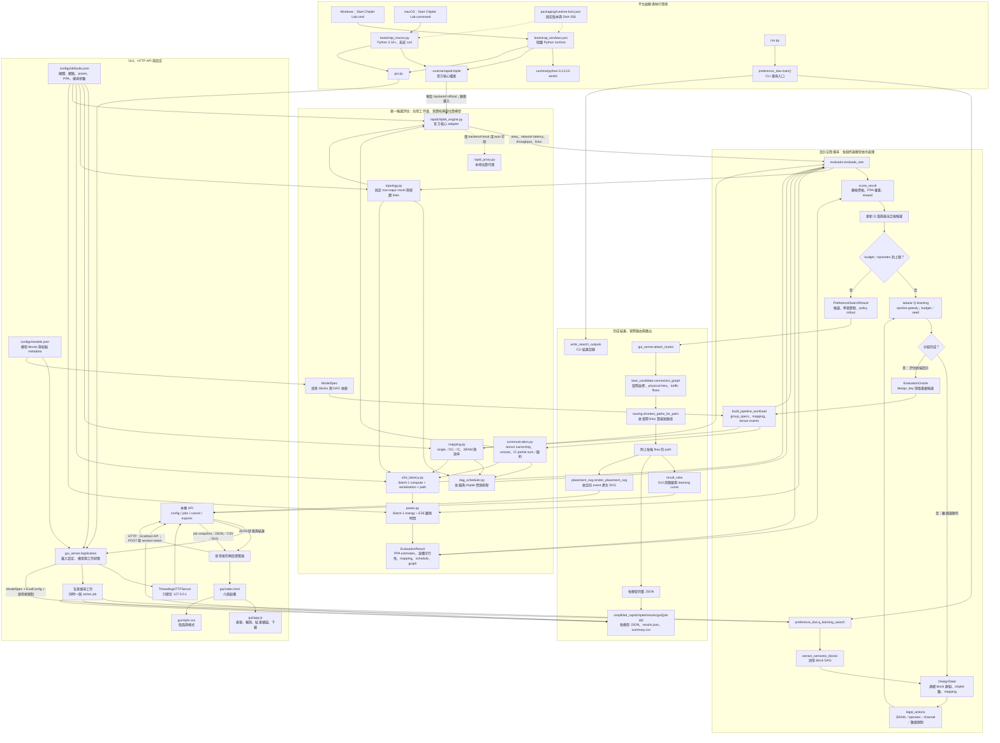
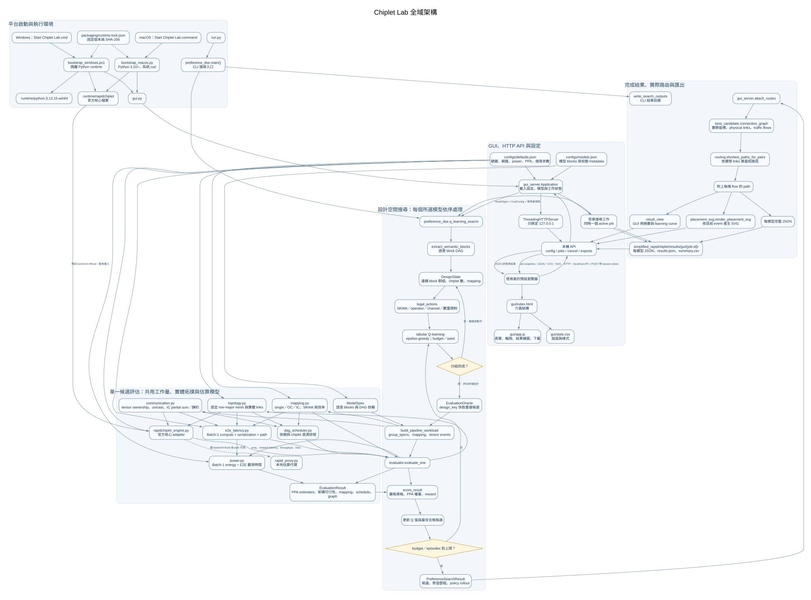
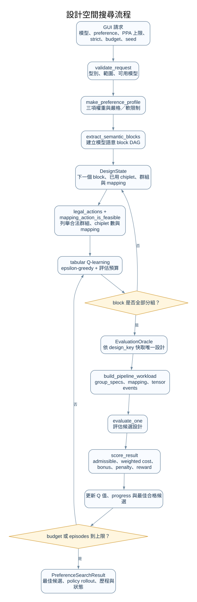
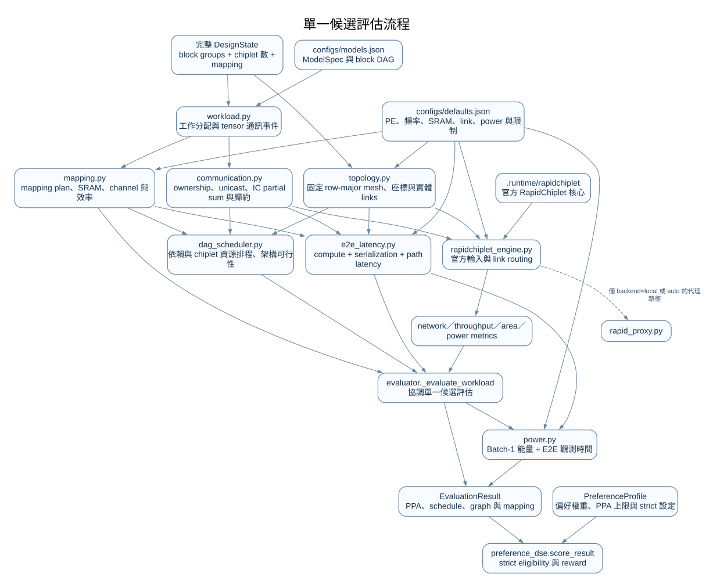

# Chiplet Lab 全域架構圖

以下是一張涵蓋整個專案的 Mermaid 全域圖：由 Windows／macOS 啟動、GUI 請求、設計搜尋、候選評估，一路連到路由、匯出與本機結果檔。虛線表示可選依賴或設定來源；實線表示主要資料／控制流程。

[開啟全域架構 SVG 向量圖](architecture_diagrams/00_global_architecture.svg)

[下載全域架構 PNG（600 DPI）](architecture_diagrams/00_global_architecture.png) · [下載輕量 PNG（150 DPI）](architecture_diagrams/00_global_architecture_150dpi.png)

## 讀圖重點

- **平台入口**：Windows 啟動器準備專案隔離 Python；macOS 啟動器使用本機 Python 3.10+ 與系統 `curl`。兩者都依 lock file 檢查官方 RapidChiplet 核心，然後啟動同一個 `gui.py`。
- **GUI 與 CLI 共用搜尋核心**：GUI 由 HTTP API 將工作交給背景執行緒；`run.py` 則呼叫 CLI 入口。兩者都進入 `q_learning_search` 和同一套候選 evaluator。
- **搜尋空間**：每個 action 將連續模型 blocks 分組，指定 chiplet 數與 `single`／OC／IC mapping；SRAM、支援的 operators、channel 整除性與 chiplet 上限會先排除不合法動作。`EvaluationOracle` 快取重複設計。
- **候選評估**：工作分配產生 tensor communication events；mapping、DAG 排程、E2E latency 與 RapidChiplet 共用模型與拓撲資料。官方 backend 是 GUI 預設；官方核心缺失時不會靜默改用 proxy。
- **PPA 邊界**：Power 是估計 Batch-1 能量除以估計觀測時間，不是實體量測；主要 latency 為 Batch-1 序列化估算。RapidChiplet 網路 latency、throughput 與固定 utilization power 另外作為 metrics／診斷資料。
- **輸出資料**：完整 job 留在 `simplified_rapidchiplet/results/gui/<job-id>/`；GUI polling 使用精簡 snapshot，下載提供 JSON／CSV，placement SVG 由同一份候選 graph 與實體路由資料產生。

## 全域圖各 flow 詳解

閱讀時可把每個箭頭理解成「把資料交給下一步」或「由這個元件啟動下一步」；所以有些箭頭代表控制呼叫，不一定是整份資料直接搬過去。實線是主要流程，虛線是條件式依賴或可選路徑。

### S0：啟動與執行環境

1. **Windows 路徑**：使用者雙擊 `Start Chiplet Lab.cmd`，啟動 `bootstrap_windows.ps1`。啟動器依 runtime lock 準備隔離的 Python runtime，並檢查 RapidChiplet 官方核心檔案及 SHA-256；環境備妥後啟動 `gui.py`。
2. **macOS 路徑**：雙擊 `Start Chiplet Lab.command`，執行 `bootstrap_macos.py`。它使用本機 Python 3.10 以上版本及系統 `curl` 準備並驗證官方核心，再啟動同一個 `gui.py`。兩個平台最後都進入同一套 GUI、搜尋和評估程式。
3. **CLI 路徑**：`run.py` 直接進入 `preference_dse.main()`，不啟動瀏覽器或 HTTP GUI；它仍使用同一個搜尋器與候選評估器。

虛線由 `packaging/runtime-lock.json` 指向啟動器，表示它提供固定版本與檔案雜湊作為下載／驗證依據。官方核心的預設 backend 是 `official`；核心無法載入時會回報錯誤，不會靜默改用代理模型。

### S1：GUI、API 與工作建立

1. `gui_server.Application` 啟動時讀取 `configs/defaults.json` 的硬體、網路、功率及搜尋設定，並讀取 `configs/models.json` 的模型 block DAG 和校驗資料。GUI 只列出完成 forward 校驗的模型。
2. `ThreadingHTTPServer` 綁定 `127.0.0.1`，提供本機 API。瀏覽器載入 `gui/index.html`，再由 `gui/app.js` 建立表單、送出請求、輪詢進度及畫結果；`gui/style.css` 負責外觀。
3. GUI 先以 `GET /api/config` 取得可用模型、硬體、PPA 預設上限、strict 選項、preference 權重、budget、seed 和本機 session token。
4. 使用者按下開始後，瀏覽器以 `POST /api/jobs` 送出模型清單、preference、三項 PPA 上限、各項是否 strict、搜尋 budget 及 seed。伺服器會驗證型別、範圍、模型校驗狀態、來源和 token；同一時間只接受一個執行中的搜尋工作。
5. 工作在背景執行緒執行。瀏覽器定期以 `GET /api/jobs/{id}` 取得進度和已完成的模型結果；取消按鈕只設定取消旗標，搜尋在下一個取消檢查點停止，不會直接強制終止 Python 程序。

### S2：偏好式設計搜尋

1. `q_learning_search` 先把 `ModelSpec` 的語意 blocks 和依賴關係整理成 block DAG。搜尋狀態記錄下一個待分組 block、已用 chiplet 數、目前的連續 block 群組，以及各群組的 mapping。
2. `legal_actions` 為下一步列舉可能的 block 群組長度、chiplet 數與 mapping。合法 mapping 有 `single`、`output_channel`（OC）和 `input_channel`（IC）；SRAM 需求、operator 支援度、channel 是否能平均切分、Head block 限制和剩餘 chiplet 預算會排除不合法動作。這裡搜尋的是 block 分組與平行策略，不是任意 chiplet 擺放。
3. Q-learning 以固定 seed 和 epsilon-greedy 在已學動作與探索動作間選擇。每走完一條 block 分組路徑，就形成完整設計並送去評估；`evaluation_budget` 限制不同設計的評估數，重複設計由 `EvaluationOracle` 以 `design_key` 快取，另有 episode 上限避免搜尋無限進行。
4. 完整設計交給 Oracle。Oracle 將群組與 mapping 轉成 workload，再呼叫 `evaluate_one`。候選結果回來後，`score_result` 依 latency、area、power 權重和使用者限制計算 reward：strict 項目超標會失去資格；soft 項目則以 bonus／penalty 納入分數。架構不可行或數值無效仍是硬性拒絕條件。
5. Reward 反向更新這條路徑上的 Q 值，並記錄 evaluation history。停止時會在已觀察的動作範圍內做 greedy policy rollout，另保留搜尋過程中 reward 最佳且符合資格的候選。有限 budget 和已觀察路徑不代表已找到整個設計空間的全域最佳解。

### S3：單一候選評估

這一段會對同一份候選設計產生 mapping、通訊、排程、延遲和功率資料，並把估算結果交回搜尋器評分。

1. **Workload 與 tensor events**：`build_pipeline_workload` 將所有模型 blocks 依搜尋結果切成連續群組，並確認每個 block 都有被分配。`communication.py` 依 tensor owner 產生外部輸入分配、block 間 dependency transfer、群組內重分配、IC partial-sum reduction，以及必要的 shortcut gather。每筆跨 chiplet 傳輸記錄來源、目的地、tensor 大小和 unicast flows；不假設硬體 multicast。同一套事件定義供排程、E2E 和 RapidChiplet adapter 使用；排程器可能依相同設定重新計算事件時序。
2. **Mapping**：`mapping.py` 估算各群組每顆 chiplet 的權重／activation 記憶體、SRAM 是否足夠、channel 分割是否合法，以及平行效率和額外 traffic。OC 會切分輸出通道；IC 會切分輸入通道，可能需要把 partial outputs 歸約。這些是架構層級估算，尚未模擬實際 tile、DRAM 或 RTL。
3. **Physical topology**：`topology.py` 依選中的 chiplet 數和硬體尺寸建立固定 row-major mesh：chiplet 排成近似正方形網格，實體 link 只連接水平和垂直鄰居，座標與 link 長度以 mm 計算。搜尋不會任意改拓撲或最佳化放置位置。
4. **DAG scheduler**：`dag_scheduler.py` 按 block DAG 的拓撲順序安排工作；每個 block 必須等所有前置 block 的資料到達，並等分配給自己的 chiplet 可用。它輸出每個 block 的開始／結束時間、關鍵路徑、同時可執行的 block 數及架構可行性。它是架構估算排程器，不是 cycle-accurate 模擬器。
5. **Batch-1 E2E latency**：`e2e_latency.py` 計算一筆推論的估算 latency：各群組 compute 時間總和，加上各 communication event 的服務時間總和。每個 event 的服務時間由 bottleneck link 的 serialization 時間和該 event 最長路徑延遲組成；目前採保守串行加總，不模擬計算／通訊重疊、佇列競爭、DRAM/cache stalls 或執行期排程。
6. **RapidChiplet metrics**：`rapidchiplet_engine.py` 把 placement、mesh links、traffic 與硬體設定轉成 RapidChiplet 輸入。官方 backend 回傳封裝／面積、網路 latency、throughput、link 和功率診斷資料；`backend=local` 使用本機代理，`auto` 才會在官方核心不可用時退回代理。GUI 預設 `official`，所以官方核心缺失時會報錯。
7. **合併結果與 power**：`evaluator.py` 合併 MappingPlan、DAG schedule、E2E latency 和 RapidChiplet metrics，產生 `EvaluationResult`，也計算輸出用 FPS：compute、network 和 pipeline 三項 FPS 的最小值。`power.py` 估算一筆推論的 energy，再除以估算的 Batch-1 observation window 得到平均功率；它不是電表量測。RapidChiplet 的 fixed-utilization power 保留為診斷數值，不等同此 Batch-1 PPA power。

### S4：路由、結果與匯出

1. 最佳候選帶有 `connection_graph`：實際 chiplet 座標、physical links 和 traffic flows。GUI 呼叫 `attach_routes` 後，程式從這份 graph 重建 topology，依實體連線計算最短路徑；路徑等長時優先較低 chiplet ID。路徑會加回每條 flow，供結果圖和 JSON 使用。
2. GUI 使用 `result_view` 產生較精簡的 job snapshot 和 learning curve，避免把完整 Q table 和整段 history 每次都傳給瀏覽器；完整資料仍保存在每模型 JSON。前端可以查看 physical links、單一 communication event，或整次推論累積 traffic。累積流量圖表示總 traffic，不代表所有封包同時傳送。
3. 背景工作在 `simplified_rapidchiplet/results/gui/<job-id>/` 寫入每模型 JSON、`results.json` 和 `summary.csv`。JSON 包含請求、狀態、結果、有效設定和來源檔 SHA-256；CSV 摘出 status、PPA、chiplet 數及 reward 等欄位。API 可下載 JSON／CSV，也會依所選 traffic event 即時產生 placement SVG。
4. CLI 不經 GUI API，呼叫 `write_search_outputs`，預設在 `results/preference_dse/` 寫入 `preference_search_results.json`、`preference_search_summary.csv` 和 `manifest.json`。

### 一次 GUI 搜尋的完整路徑

`啟動器 → 本機 GUI／設定 → POST 工作請求 → 驗證與建立背景工作 → 對每個所選模型執行 Q-learning → 評估完整候選 → preference reward 與 Q 更新 → 挑出合格最佳候選 → 依實際 links 加路徑 → 寫 JSON／CSV／placement SVG → 瀏覽器檢視或下載。`

## 局部詳細圖

### 設計空間搜尋

[Markdown 詳圖](architecture_diagrams/02_search_flow.md) · [Mermaid 原始碼](architecture_diagrams/02_search_flow.mmd) · [SVG 向量圖](architecture_diagrams/02_search_flow.svg) · [PNG（600 DPI）](architecture_diagrams/02_search_flow.png) · [PNG 輕量版（150 DPI）](architecture_diagrams/02_search_flow_150dpi.png)

### 單一候選評估

[Markdown 詳圖](architecture_diagrams/03_candidate_evaluation.md) · [Mermaid 原始碼](architecture_diagrams/03_candidate_evaluation.mmd) · [SVG 向量圖](architecture_diagrams/03_candidate_evaluation.svg) · [PNG（600 DPI）](architecture_diagrams/03_candidate_evaluation.png) · [PNG 輕量版（150 DPI）](architecture_diagrams/03_candidate_evaluation_150dpi.png)

## 主要模組索引

| 範圍 | 檔案 |
|---|---|
| 啟動 | `Start Chiplet Lab.cmd`、`Start Chiplet Lab.command`、`scripts/bootstrap_windows.ps1`、`scripts/bootstrap_macos.py` |
| GUI | `gui.py`、`simple_rapidchiplet/gui_server.py`、`gui/index.html`、`gui/app.js`、`gui/style.css` |
| 搜尋 | `simple_rapidchiplet/preference_dse.py`、`simple_rapidchiplet/block_extractor.py` |
| 模型與工作 | `simple_rapidchiplet/model.py`、`simple_rapidchiplet/workload.py`、`simple_rapidchiplet/communication.py` |
| 架構評估 | `simple_rapidchiplet/mapping.py`、`simple_rapidchiplet/topology.py`、`simple_rapidchiplet/dag_scheduler.py`、`simple_rapidchiplet/e2e_latency.py`、`simple_rapidchiplet/power.py` |
| RapidChiplet 與結果 | `simple_rapidchiplet/rapidchiplet_engine.py`、`simple_rapidchiplet/evaluator.py`、`simple_rapidchiplet/routing.py`、`simple_rapidchiplet/placement_svg.py` |

圖中 PPA、latency、energy 是程式模型的分析估算，並非實體 chiplet 測量。Q-learning 的有限搜尋預算也不保證找到全域最佳設計。
