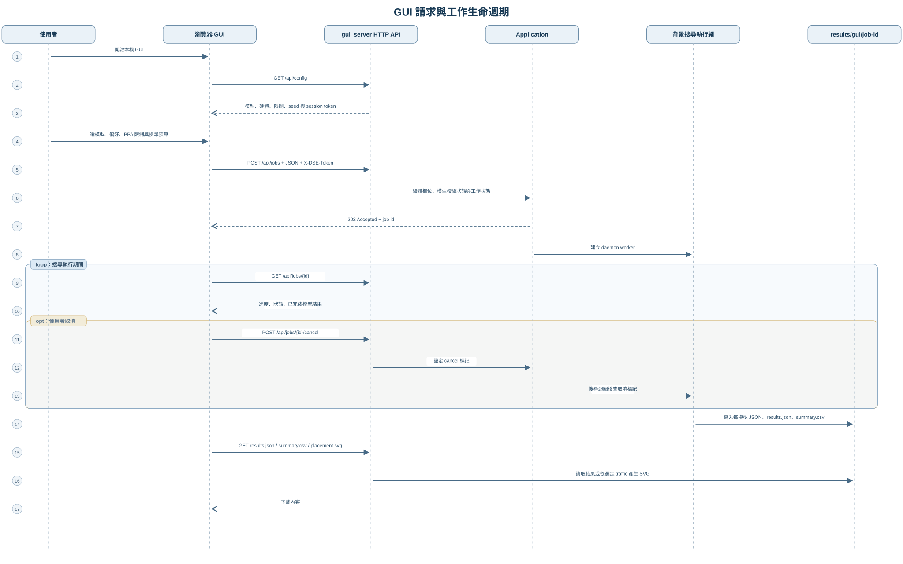
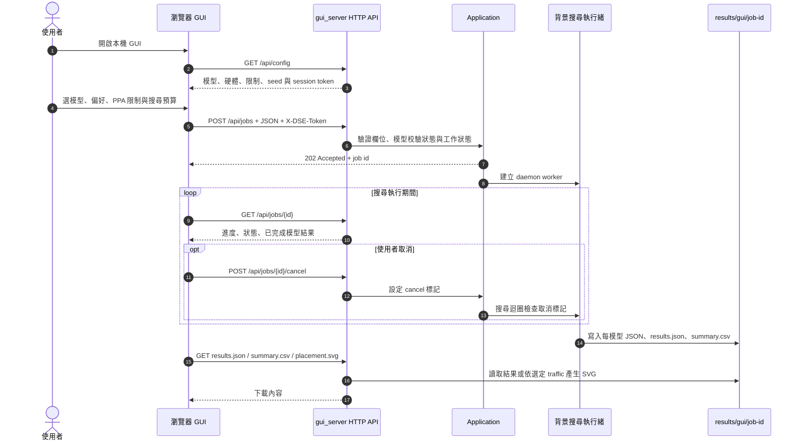

# GUI 請求與工作生命週期

瀏覽器如何讀取設定、提交工作、查詢進度、取消工作與下載結果。

[開啟 SVG 向量圖](01_gui_lifecycle.svg)

[下載高解析 PNG（600 DPI）](01_gui_lifecycle.png) · [下載輕量 PNG（150 DPI）](01_gui_lifecycle_150dpi.png)

```mermaid
sequenceDiagram
  autonumber
  actor User as 使用者
  participant Web as 瀏覽器 GUI
  participant API as gui_server HTTP API
  participant App as Application
  participant Job as 背景搜尋執行緒
  participant Disk as results/gui/job-id

  User->>Web: 開啟本機 GUI
  Web->>API: GET /api/config
  API-->>Web: 模型、硬體、限制、seed 與 session token
  User->>Web: 選模型、偏好、PPA 限制與搜尋預算
  Web->>API: POST /api/jobs + JSON + X-DSE-Token
  API->>App: 驗證欄位、模型校驗狀態與工作狀態
  App-->>Web: 202 Accepted + job id
  App->>Job: 建立 daemon worker
  loop 搜尋執行期間
    Web->>API: GET /api/jobs/{id}
    API-->>Web: 進度、狀態、已完成模型結果
    opt 使用者取消
      Web->>API: POST /api/jobs/{id}/cancel
      API->>App: 設定 cancel 標記
      App->>Job: 搜尋迴圈檢查取消標記
    end
  end
  Job->>Disk: 寫入每模型 JSON、results.json、summary.csv
  Web->>API: GET results.json / summary.csv / placement.svg
  API->>Disk: 讀取結果或依選定 traffic 產生 SVG
  API-->>Web: 下載內容
```
