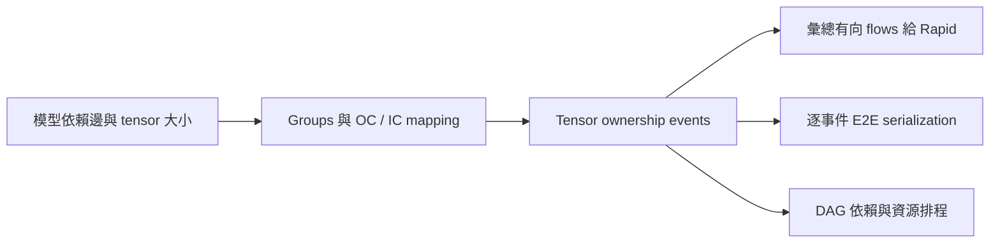

# 0917 修正版：PPA、RL 與 traffic 說明

修改基底：0917 repository 的 `1dc98c3f607692b0da6c8fe22e3676cbbc8ab08c`。本地資料夾為 `audit_0917_snapshot/simplified_rapidchiplet`；不是旁邊另一份較舊的 `simplified_rapidchiplet`。

## 使用方式與設定

在 VS Code 開啟這個資料夾，設定檔是 **`configs/defaults.json`**（檔名有 s）。終端機執行：

```powershell
python .\run.py --preference balanced --max-latency-ns 500000000 --max-area-mm2 800 --max-power-w 16
```

一般使用者只需選 PPA 上限及 preference。`latency`、`area`、`power` 三個偏好使用 0.8 / 0.1 / 0.1 權重，`balanced` 三者相等。未在命令列指定的 PPA 上限取自 JSON；預設模型為 ResNet-50。`preference_dse.py` 與 `run.py` 是同一入口。

FPS 沒有目標、最低要求、bonus、penalty，也不進入 reward、PPA score 或 power。`achieved_fps` 只在評估完成後輸出，取 compute、network、pipeline 三個估計上限的最小值。它是解析模型的吞吐量估計，不是實測 FPS。

硬體與搜尋參數是實驗平台設定，一般使用者不用每次輸入。預設搜尋為 128 個不同設計，最多 3000 episodes；重複設計會用快取，不再呼叫 Rapid。進階重現可指定 `--budget`、`--episodes`、`--seed`、`--config`、`--out`。

輸出在 `results/preference_dse/`：

- `preference_search_summary.csv`：PPA、是否達標、FPS。
- `preference_search_results.json`：最佳已評估候選、Q 政策、Q-table、探索歷程、完整 tensor events、mapping 與排程。
- `manifest.json`：實際設定及模型／程式 SHA-256。候選的 `backend` 顯示使用 `official` 或 `local`。

## 1. RL 到底有沒有學 mapping strategy？

原本存在實際錯誤：evaluation cache 只以 groups 當 key，相同分組但不同 strategy 會拿到同一個結果。修正版 key 同時包含 groups 與每組 strategy；single-chiplet 的策略才會正規化為 `single`。

動作是 `(group_length, chiplets, mapping_strategy)`；狀態保存已完成的 groups、strategies、剩餘位置、已用顆數、模型、偏好及限制。策略可選 `single`、`output_channel`（OC）、`input_channel`（IC）。合法動作會檢查 SRAM、channel 可分割性、Head 限制，以及剩下的 block 是否還能在顆數限制內完成。

第一個 episode 使用確定性的最少 chiplet 起始候選。之後 epsilon 探索所有合法動作；利用階段依已學動作的 Q 值選擇。避免把所有未探索後繼都當成樂觀高分，導致真正量到的 terminal reward 永遠傳不回前段動作。每次完成 mapping 後，用 terminal PPA reward 反向更新整條 trajectory；新動作由第一個量到的 target 初始化。

令各 PPA 比值為 `metric / limit`，`cost` 是偏好加權和；`V` 是所有超限比例的總和。架構不可行、NaN／Infinity 指標另外算違規。

- 可行設計：`reward = 1 / (1 + cost)`，為正值。
- 不可行設計：`reward = -1 - V / (1 + V)`，小於 -1；無效無窮數值給 -2。
- 所以可行設計一定勝過不可行設計；不可行時先減少總違規，並明確列出違規項目。
- discount 固定為 1，避免單純因為 group 數不同而改變同一終端 PPA 的價值。

搜尋結束後，另在已觀察到的轉移上做 Bellman replay，輸出 greedy policy。`best_candidate` 是最佳已評估紀錄；`policy_rollout` 是從 Q 值逐步選動作得到的候選。兩者分開輸出並檢查 reward 是否一致，不能只把 best archive 冒充為學到的政策。

**這是單次設計任務的 tabular Q-learning。** 它能學已評估動作的 mapping 選擇；尚未證明能泛化到未見過的模型／硬體／偏好。預設 ResNet-50 在目前 action mask 下有 20,176,298 個設計；128 次評估不構成全域最優證明。只有小型完整枚舉空間的測試可認證全域最優，輸出 `global_optimum_certified` 明確區分。

## 2. 給 Rapid 的 traffic 如何連接？

唯一資料來源是 `simple_rapidchiplet/communication.py`。先追蹤每個 tensor 的擁有者及 channel 區間，再生成每 inference 的有向 unicast 流。`workload.py` 將同一 source/target 的各事件加總後給 Rapid；E2E 與 DAG scheduler 讀取同一組 events。沒有另一份 legacy chain traffic 疊加進來。



以下假設跨組、不共用 chiplet，前一組完整 output 大小為 **8 MiB**；只列該邊界的資料量，組內 reduction 另外列帳。

| 情況 | 正確連線與資料量 |
| --- | --- |
| 1 → 3，接收端 OC | 三顆各需完整 input，各送 8 MiB，共 24 MiB。這是三份 unicast，沒有假設硬體 multicast。 |
| 1 → 2，接收端 IC | 兩顆各需半份 input，各送 4 MiB，共 8 MiB。 |
| 2 → 1，來源 OC | 兩顆持有不同 output channel shard，各送 4 MiB，共 8 MiB。 |
| 2 → 1，來源 IC | 兩顆先產生各自的完整 partial output；非 leader 送 8 MiB 給 leader 相加，完成後只由 leader 向下一組送完整 8 MiB。不是把 partial output 當完整結果直接各送半份。 |
| OC 2 → OC 2 | 每個 destination 都需完整 input；四條流各 4 MiB，共 16 MiB。 |
| OC 2 → IC 2 | 依 channel 區間交集配對；對齊時兩條流各 4 MiB，共 8 MiB。不能一律除以 `source_count × destination_count`。 |

同一顆 chiplet 已有的資料不產生網路流。source ownership 的缺片、重疊或無效區間會被拒絕。

模型分支 `A → B`、`A → C` 會建立兩個消費事件；join `B → D`、`C → D` 保留兩個不同 tensor 的來源及大小。D 的排程必須等兩邊的資料都到齊，不會只接其中一個，也不會憑 block 順序加上不存在的 B → C。

同組多 block 仍可能需要資料交換：OC 在下一個 Conv 前需補齊 input shards；IC 每個 Conv 的 partial results 需先 reduction，再分配下一個 Conv 的 input。ResNet Bottleneck 內的兩個 Conv 邊界、projection shortcut reduction、必要的 identity shortcut gather 都有事件，不會因為合併成一個 block 就消失。Stem 的 reduction 使用 MaxPool 前的大小。若 IC 同組 leader 已保留完整輸入，identity shortcut 直接重用，不再收回一次；跨組分片輸入才需要 gather。其他跨消費事件的 cache 重用未建模。

邏輯 flow 不等於一條新增的實體線。實體仍是 mesh；每條 flow 依最短路徑、同長時最低 ID 優先，可能經過中繼 chiplet。每個方向分別累計通過的 bits。E2E 每事件取最忙有向 link 的 `bits / (bits_per_cycle × Hz)`，再加最長路徑延遲。最終 Batch=1 latency 將所有 compute 與事件 service 相加。

## 3. ResNet-50 的 size 為何不同？

已固定定義為 torchvision ResNet-50 **v1.5、N=1、3×224×224、1000 classes、FP32**。`tools/calibrate_resnet50.py` 可依形狀公式重建 metadata；沒有下載模型或宣稱量測過模型精度。

| 量 | 修正版 |
| --- | --- |
| 可訓練參數（含 BN affine） | 25,557,032 |
| FP32 參數容量 | 102,228,128 bytes = 102.228128 MB = 97.492340 MiB |
| Conv／Linear MAC | 4.089184256 G MAC |
| 用 1 MAC = 2 operations 換算 | 8.178368512 G operations |
| Stem 經 MaxPool 後 output | 64×56×56 = 0.765625 MiB |
| conv2_x Bottleneck output | 256×56×56 = 3.0625 MiB |
| conv3_x／conv4_x／conv5_x output | 1.53125／0.765625／0.3828125 MiB |

以前的 stage output 部分沿用了不適合 ResNet-50 expansion 的數字，因此不只存在 MB/MiB 差異。修正版有 Stem、16 個 Bottleneck、Head 共 18 blocks，每個 block 的 MAC、weight、input/output 及內部 activation 已重算。參數 bytes 不等於 checkpoint 檔案大小，也不含 optimizer state、BN running buffers；MAC 範圍不含 BN、ReLU、pooling 等操作。FP16、INT8、v1/v1.5 或不同輸入尺寸自然會得到不同 size。

定義來源：[torchvision 0.18 ResNet 原始碼](https://docs.pytorch.org/vision/0.18/_modules/torchvision/models/resnet.html)。其他 catalog 模型仍是未完成同等校驗的解析原型，因此預設只執行 ResNet-50。

## 4. Rapid 是否真的吃到設定？

修正版直接由 `defaults.json` 生成 chiplets、placement、topology、packaging、technology、routing、traffic 的記憶體輸入，交給正式 Rapid。**不再讀取 chiplet example 的 power。** Link bandwidth 透過正式引擎使用的 `intermediates["link_bandwidths"]` 為每個方向明確指定，不依賴引擎是否支援額外 JSON override 欄位。

依附檔保留：8×8 PE、200 MHz、utilization 0.75、width 8.79772697916911 mm、spacing 0.15 mm、internal/PHY latency 3/12 cycles。SRAM 16 MiB 是 0917 原有平台假設，附檔沒有指定。

```text
每顆 chiplet power = 0.15 + 0.85 × 0.75 + 0.03 = 0.8175 W
總 power = 顆數 × 0.8175 + Σ(實體 link 長度 × 0.005 W/mm)
link latency = ceil(1 + 0.25 × link 長度) cycles
```

0.03 W 是 0815 的每顆 aggregate PHY 項，不能又乘四。封裝為 passive；link 長度統一使用 chiplet 中心距離。`0.5 pJ/bit` 另輸出為每 inference 的 link dynamic energy，按 bit-hops 計算；依原固定 utilization power 定義，沒有借 FPS 把它改算成另一套 workload power。

附檔的 **有效頻寬是 0.3 bits/cycle/direction = 0.06 Gbit/s**，其 `baseline` 才是 **256 bits/cycle = 51.2 Gbit/s**。預設保留 0.3 的 stress test，沒有私自切回 256；驗證工具會另外標示 256 的敏感度案例。

正式與本地引擎的回歸測試會改變 power 與頻寬，檢查每條 link 實際值、power 增量、吞吐量比例，以及 area／ICI latency／power／network FPS 一致性。`auto` 模式在正式引擎不存在時會警告並標示 `local`；要禁止 fallback，將 backend 設為 `official`。

## 驗證與界線

```powershell
python -m unittest discover -s tests
python tools/validate_0917.py
```

驗證結果另見 `VALIDATION_0917_zh-TW.md`。第二個命令要求正式 Rapid，執行三個 seed 的 0.3 頻寬搜尋與四種偏好的 256 頻寬比較，每次 128 個不同候選，並和相同預算、相同起始候選的 random search 對照。

目前是解析架構模型：SRAM 採 resident weights 與保守 activation buffer 檢查；OC/IC compute efficiency 仍為假設值（0.95/0.85，再隨顆數調整），未以真實 accelerator 校準。Reduction 的加法計算時間未單獨列項，通訊量則已計入。spatial mapping 因缺 tile、halo 與 ownership metadata 已停用。沒有 DRAM streaming／memory latency、網路 queue 或 compute/communication overlap 模擬；DAG scheduler 可表達分支相依，但不做跨事件的完整網路排隊。主要 PPA latency 用串行事件相加，對有並行分支的 DAG 會較保守。

因此「連線與計量一致、RL 能更新及使用 mapping action、測試通過」不等於「真實晶片效能已驗證」或「RL 永遠優於其他搜尋方法」。歷史簡報工具及 DP pool 實驗保留供追溯，不能拿舊 FPS-target 報表當本版的新結果。
